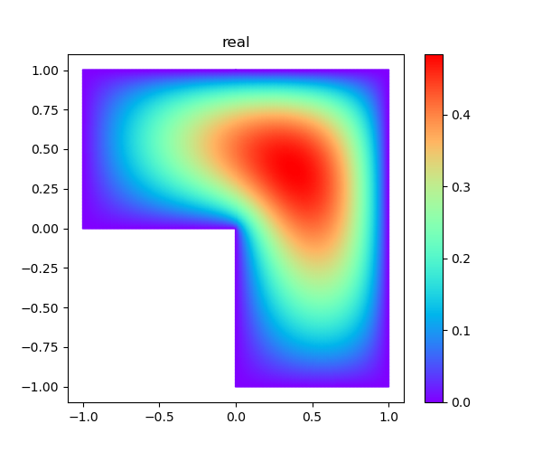
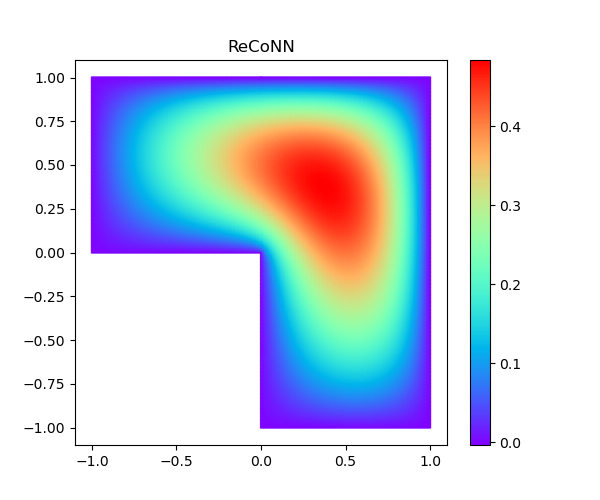
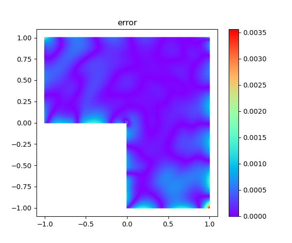
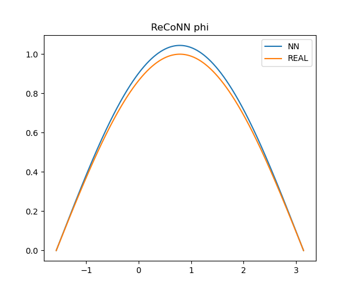
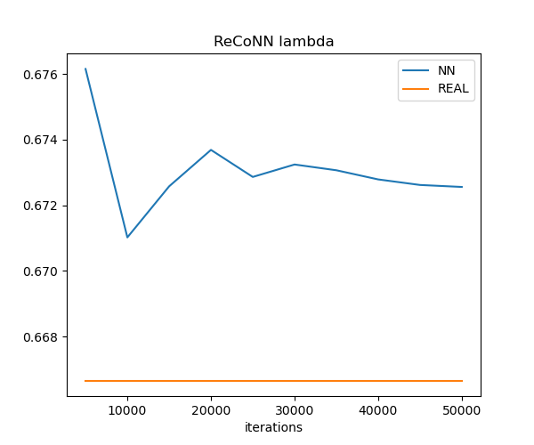
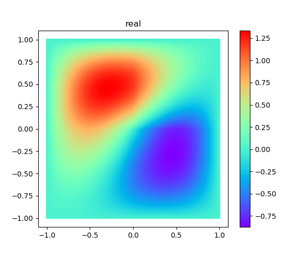

# Regularity-Conforming Neural Networks (ReCoNNs) for solving Partial Differential Equations

The **official** version : https://github.com/Mathmode/ReCoNNs

This is the **unofficial** pytorch version implementation of the paper "Regularity-Conforming Neural Networks (ReCoNNs)
for
solving Partial Differential Equations".

## Tips

There are several mistakes about the equations of the paper.

Assume the figures are correct, and then the equations should be consistent with the figures.

1. equation(1) should be

$$
u(x) =
\begin{cases}
\frac{1}{3} \sin (2x),x \in [0, \frac{\pi}{2}],\\
\sin (2x),x \in [\frac{\pi}{2}, \pi].\\
\end{cases}
$$

2. equation(28) should be

$$
\sigma(x) =
\begin{cases}
3,\lvert x \rvert < \frac{1}{2},\\
1,else.\\
\end{cases}
$$

3. equation(29) should be

$$
u^*(x)=\frac{(x_1^2-1)(x_2^2-1)(4x_1^2+4x_2^2-1)}{\sigma(x)}
$$

4. equation(32) should be

$$
s_0(r,\theta)=r^\frac{2}{3}\sin \left( \frac{2}{3}\left(\theta+\frac{\pi}{2}\right) \right)
$$

5. page 18, below equation(34). The text content "We set ..." should be "We set $\delta_1=0.5$ $\delta_2=0.9$ in our
   implementation."

maybe there are other mistakes.

## Numerical results

### 1 1D Transmission problem

Compare the results of "vanilla PINNs[[1]](https://doi.org/10.1016/j.jcp.2018.10.045)" and "
XPINNs[[2]](https://doi.org/10.4208/cicp.OA-2020-0164)" with those of "ReCoNNs".


### 2 Smooth material interface

Compare the results of real solution with those of "ReCoNNs".


### 3 L-shape domain

#### The neuron-counts for the implemented NN:

- Function $w$ :
  
  $2012 = \underbrace{2\times30+30}\_{L1} + \underbrace{30\times30+30}\_{L2} + \underbrace{30\times30+30}\_{L3} + \underbrace{30\times2+2}\_{L4}$ 

- Function $\phi$ :

  $541 (\neq 542) = \underbrace{2\times15+15}\_{L1} + \underbrace{15\times15+15}\_{L2} + \underbrace{15\times15+15}\_{L3} + \underbrace{15\times1+1}\_{L4}$  

- Trainalbe $\lambda$ : $1$

- Total : $2554 = 2012+541+1$

#### Results of the real solution with those of "ReCoNNs".





The NN function $\phi$ and the target $\sin$ fuction.



The trainalbe parameter $\lambda$ changes with the iterations.



### 4 Interior material vertices

#### The neuron-counts for the implemented NN :

- Function $w$ :

  $2136 = \underbrace{2\times30+30}\_{L1} + \underbrace{30\times30+30}\_{L2} + \underbrace{30\times30+30}\_{L3} + \underbrace{30\times6+6}\_{L4}$  

- Function $\phi$ :
 
  $573 = \underbrace{2\times15+15}\_{L1} + \underbrace{15\times15+15}\_{L2} + \underbrace{15\times15+15}\_{L3} + \underbrace{15\times3+3}\_{L4}$  

- Trainable $\lambda$ : $1$

- Total : $2710=2136+573+1$

#### The specific expression of $u_{NN}$ in the implementation:

$$
u_{NN} = w_{1,0}(x) + w_{2,0}(x)\eta(\lvert x-x_0 \rvert) + [w_{1,1}(x)+ w_{2,1}(x)\eta(\lvert x-x_0 \rvert)]\lvert \varphi_1(x)\rvert + [w_{1,2}(x)+ w_{2,2}(x)\eta(\lvert x-x_0 \rvert)]\lvert \varphi_2(x)\rvert + 
 \eta(\lvert x-x_0 \rvert){\lvert x-x_0 \rvert}^{\lambda}[\phi_1(\frac{x-x_0}{\lvert x-x_0 \rvert})+\phi_2(\frac{x-x_0}{\lvert x-x_0 \rvert})\lvert \hat\varphi_1(\frac{x-x_0}{\lvert x-x_0 \rvert}) \rvert+\phi_3(\frac{x-x_0}{\lvert x-x_0 \rvert})\lvert \hat\varphi_2(\frac{x-x_0}{\lvert x-x_0 \rvert}) \rvert]
$$

where

$$
\varphi_1(\vec{x}) = \hat\varphi_1(\vec{x}) = x_1 \quad\rm{and}\quad \varphi_2(\vec{x}) = \hat\varphi_2(\vec{x}) = x_2
$$

#### Test numerical experiments with 3 different loss-function settings:

Remark that resample every 1000 iterations.  

| experiment number | Interface loss  | bc - $\phi$ loss |
| ---- | ---- | ---- |
| 1 | regular component + **complete** singular component | **complete** singular component |
| 2 | regular component + **complete** singular component | **simplified** singular component |
| 3 | regular component | **simplified** singular component |

1. Same as the **official** version : https://github.com/Mathmode/ReCoNNs .

- Interface loss : regular component + complete singular component which is

$$\eta(\lvert x-x_0 \rvert){\lvert x-x_0 \rvert}^{\lambda}[\phi_1(\frac{x-x_0}{\lvert x-x_0 \rvert})+\phi_2(\frac{x-x_0}{\lvert x-x_0 \rvert})\lvert \hat\varphi_1(\frac{x-x_0}{\lvert x-x_0 \rvert}) \rvert+\phi_3(\frac{x-x_0}{\lvert x-x_0 \rvert})\lvert \hat\varphi_2(\frac{x-x_0}{\lvert x-x_0 \rvert}) \rvert]$$

- bc - $\phi$ loss : complete singular component which is

$$\eta(\lvert x-x_0 \rvert){\lvert x-x_0 \rvert}^{\lambda}[\phi_1(\frac{x-x_0}{\lvert x-x_0 \rvert})+\phi_2(\frac{x-x_0}{\lvert x-x_0 \rvert})\lvert \hat\varphi_1(\frac{x-x_0}{\lvert x-x_0 \rvert}) \rvert+\phi_3(\frac{x-x_0}{\lvert x-x_0 \rvert})\lvert \hat\varphi_2(\frac{x-x_0}{\lvert x-x_0 \rvert}) \rvert]$$

2. simplified bc - $\phi$ loss version.

- Interface loss : regular component + complete singular component which is

$$\eta(\lvert x-x_0 \rvert){\lvert x-x_0 \rvert}^{\lambda}[\phi_1(\frac{x-x_0}{\lvert x-x_0 \rvert})+\phi_2(\frac{x-x_0}{\lvert x-x_0 \rvert})\lvert \hat\varphi_1(\frac{x-x_0}{\lvert x-x_0 \rvert}) \rvert+\phi_3(\frac{x-x_0}{\lvert x-x_0 \rvert})\lvert \hat\varphi_2(\frac{x-x_0}{\lvert x-x_0 \rvert}) \rvert]$$

- bc - $\phi$ loss : simplified singular component ( take $\frac{x-x_0}{\lvert x-x_0 \rvert}$ as the input when computing gradient) which is

$$\phi_1(\frac{x-x_0}{\lvert x-x_0 \rvert})+\phi_2(\frac{x-x_0}{\lvert x-x_0 \rvert})\lvert \hat\varphi_1(\frac{x-x_0}{\lvert x-x_0 \rvert}) \rvert+\phi_3(\frac{x-x_0}{\lvert x-x_0 \rvert})\lvert \hat\varphi_2(\frac{x-x_0}{\lvert x-x_0 \rvert}) \rvert$$

3. simplified interface loss and bc - $\phi$ loss version.

- Interface loss : regular component 

- bc - $\phi$ loss : simplified singular component ( take $\frac{x-x_0}{\lvert x-x_0 \rvert}$ as the input when computing gradient) which is

$$\phi_1(\frac{x-x_0}{\lvert x-x_0 \rvert})+\phi_2(\frac{x-x_0}{\lvert x-x_0 \rvert})\lvert \hat\varphi_1(\frac{x-x_0}{\lvert x-x_0 \rvert}) \rvert+\phi_3(\frac{x-x_0}{\lvert x-x_0 \rvert})\lvert \hat\varphi_2(\frac{x-x_0}{\lvert x-x_0 \rvert}) \rvert$$


#### Results of the real solution with those of "ReCoNNs".



1. experiment 1


The NN function $\phi$ and the target $\sin$ fuction.


2. experiment 2


The NN function $\phi$ and the target $\sin$ fuction.


3. experiment 3


The NN function $\phi$ and the target $\sin$ fuction.


## Citation

If you find their work useful in your research, please cite:

```
@article{taylor2024regularity,
  title={Regularity-Conforming Neural Networks (ReCoNNs) 
         for solving Partial Differential Equations},
  author={Taylor, Jamie M 
          and Pardo, David 
          and Mu{\~n}oz-Matute, Judit},
  journal={arXiv preprint arXiv:2405.14110},
  year={2024}
}
```

## Other reference

[1] Raissi M, Perdikaris P, Karniadakis G E. Physics-informed neural networks: A deep learning framework for solving
forward and inverse problems involving nonlinear partial differential equations[J]. Journal of Computational physics,
2019, 378: 686-707.

[2] Jagtap A D, Karniadakis G E. Extended physics-informed neural networks (XPINNs): A generalized space-time domain
decomposition based deep learning framework for nonlinear partial differential equations[J]. Communications in
Computational Physics, 2020, 28(5).
