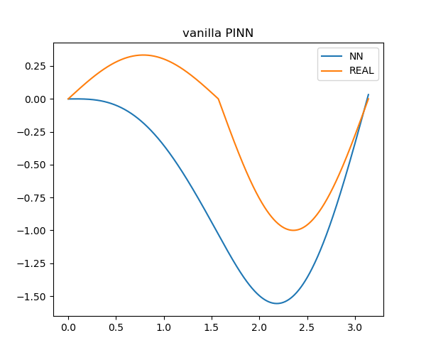
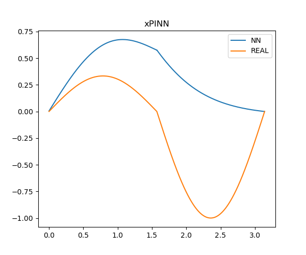
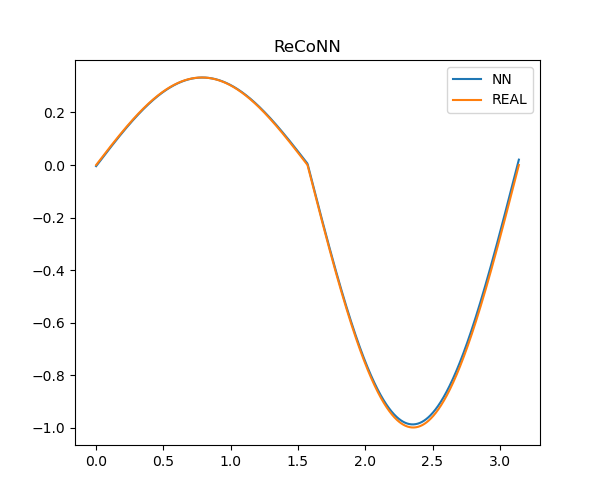
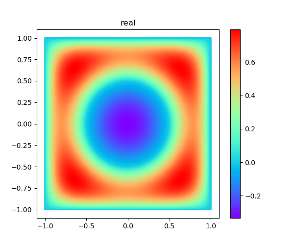
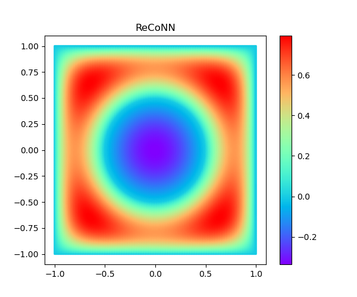
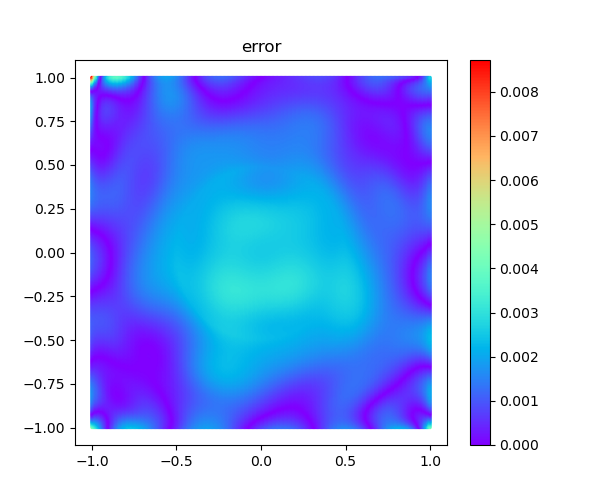

# Regularity-Conforming Neural Networks (ReCoNNs) for solving Partial Differential Equations

This is the **unofficial** pytorch version implementation of the paper "Regularity-Conforming Neural Networks (ReCoNNs)
for
solving Partial Differential Equations".

## Tips

There are several mistakes about the equations of the paper. 

Assume the figures are correct, and then the equations should be consistent with the figures.

1. equation(1) should be

$$
u(x) = 
 \begin{cases}
 \frac{1}{3} \sin (2x),\,\,x \in [0, \frac{\pi}{2}],\\
 \sin (2x),\,\,x \in [\frac{\pi}{2}, \pi].\\
 \end{cases}
$$

2. equation(28) should be

$$
\sigma(x) = 
 \begin{cases}
 3,\,\,\lvert x \rvert < \frac{1}{2},\\
 1,\,\,else.\\
 \end{cases}
$$

3. equation(29) should be

$$
u^*(x)=\frac{(x_1^2-1)(x_2^2-1)(4x_1^2+4x_2^2-1)}{\sigma(x)}
$$

4. maybe there are other mistakes


## Numerical results

### 1 1D Transmission problem

Compare the results of "vanilla PINNs[[1]](https://doi.org/10.1016/j.jcp.2018.10.045)" and "
XPINNs[[2]](https://doi.org/10.4208/cicp.OA-2020-0164)" with those of "ReCoNNs".





### 2 Smooth material interface

Compare the results of real solution with those of "ReCoNNs".





## Citation

If you find our work useful in your research, please cite:

```
@article{taylor2024regularity,
  title={Regularity-Conforming Neural Networks (ReCoNNs) 
         for solving Partial Differential Equations},
  author={Taylor, Jamie M 
          and Pardo, David 
          and Mu{\~n}oz-Matute, Judit},
  journal={arXiv preprint arXiv:2405.14110},
  year={2024}
}
```

## Other reference

[1] Raissi M, Perdikaris P, Karniadakis G E. Physics-informed neural networks: A deep learning framework for solving
forward and inverse problems involving nonlinear partial differential equations[J]. Journal of Computational physics,
2019, 378: 686-707.

[2] Jagtap A D, Karniadakis G E. Extended physics-informed neural networks (XPINNs): A generalized space-time domain
decomposition based deep learning framework for nonlinear partial differential equations[J]. Communications in
Computational Physics, 2020, 28(5).